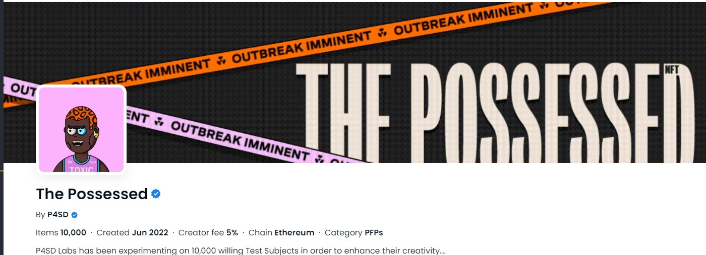

# NFT-Gallery

Create an NFT gallery by querying blockchain data. Enter the wallet and collection addresses of the NFT's you would like to fetch and HAZAA! This application will allow you to query blockchain databases, using the Alchemy API to connect to the blockchain, and creating an NFT Gallery through handling of metadata.

## Demo


## Built with

- Solidity

- Next.js

- Tailwind CSS

## Installation

```
Clone repo
```

```
install dependencies
```

```
npm run dev
```

## Contributor

Erik Williams

### special thanks to the creator of this NFT collection:

[](hhttps://opensea.io/collection/thepossessed)
